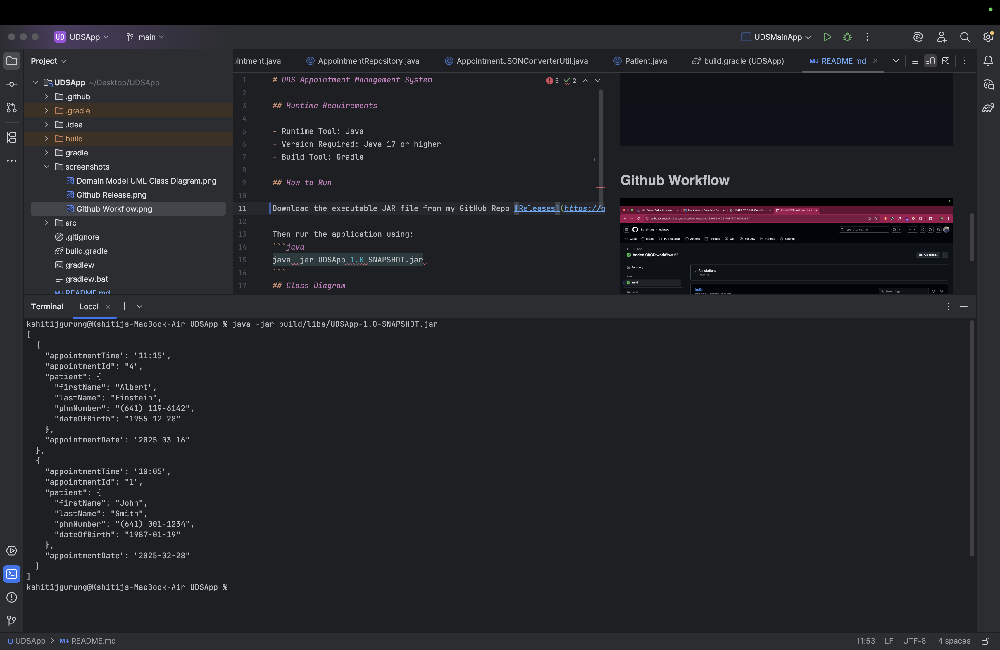

# UDS Appointment Management System

## Runtime Requirements

- Runtime Tool: Java
- Version Required: Java 17 or higher
- Build Tool: Gradle

## How to Run

Download the executable JAR file from my GitHub Repo [Releases](https://github.com/kshitij-grg/udsApp).

Then run the application using:
```java
java -jar UDSApp-1.0-SNAPSHOT.jar
```
## Class Diagram


## Github Release


## Github Workflow


## Output
